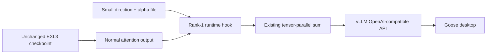

# DeepSeek V4.1 Flash EXL3 on two DGX Sparks — with Goose

A practical record of a working two-node deployment, including the small runtime hook used to reproduce an abliteration-style rank-1 edit **without changing the EXL3 checkpoint**.

**Built on two upstream projects:** we took the edit from [drowzeys' DeepSeek-V4.1-Flash-Abliterated-Cybersecurity-Unleashed](https://huggingface.co/drowzeys/DeepSeek-V4.1-Flash-Abliterated-Cybersecurity-Unleashed), recovered an approximate rank-1 representation, and made it work as a runtime hook with [Mia AI Lab's DeepSeek-v4.1-Flash-EXL3-2x-DGX-Sparks](https://github.com/MiaAI-Lab/DeepSeek-v4.1-Flash-EXL3-2x-DGX-Sparks). Credit goes to **drowzeys for the original abliteration sidecar** and **Mia AI Lab for the EXL3 checkpoint and two-Spark serving foundation**. Our contribution is the offline characterization, runtime integration, and deployment and Goose verification documented here.

**Verified 16 September 2026:** both Spark ranks running; all 26 target layers firing at alpha 3.5; Goose 1.49.0 returned `GOOSE LINK OK` through its saved provider in 3.3 seconds. This is a community reproduction guide, not an official DeepSeek, Mia AI Lab, NVIDIA, or Goose release.

## The idea in one minute

Mia AI Lab's 2.9-bits-per-weight EXL3 checkpoint and file-backed Engram make DeepSeek-V4.1-Flash fit across two DGX Sparks. The original edited attention sidecar uses FP8 weights and scales; Mia's loader expects EXL3 trellis tensors. Those representations cannot be directly swapped.

We characterized the edit offline and recovered an approximate shared direction. Instead of re-quantizing the model, a runtime hook applies:

```text
y' = y − α r (rᵀ y)
```

This happens at `attn.wo_b` on layers 10–35, using a shared 5,120-dimensional unit vector and alpha 3.5. The calculation follows the existing EXL3 operation, so the packed weights stay unchanged. At 3.5 this **reverses and amplifies** that component; only alpha 1 would be a projection that removes it.



The hook's math is format-independent, but its insertion point is specific to this model and serving stack. It is an approximation of the upstream edit, not a claim of exact equivalence or universal refusal removal. A separate Mia-compatible **EXL3 weight sidecar now exists upstream**; that is a different route, and was not what we deployed.

## Start here

1. **[Reproduce the deployment](docs/REPRODUCE.md):** hardware, network, pinned downloads, stock baseline, parameter derivation, image build, and hook launch.
2. **[Connect Goose](docs/GOOSE.md):** exact model name, correct base URL, context size, and a real client check.
3. **[Troubleshooting and rollback](docs/OPERATIONS.md):** missing worker, temporary mounts, GID mismatch, caches, and reverting to stock.
4. **[How the edit was recovered](docs/DESIGN.md):** FP8 decoding, rank-1 analysis, tensor parallelism, and the alpha correction.
5. **[Measured evidence](evidence/RESULTS.md)** and **[Hugging Face distribution options](docs/HUGGING_FACE.md)**.

## What you need

| Component | Tested setup |
| --- | --- |
| Hardware | Two NVIDIA DGX Sparks, GB10, about 121.69 GiB unified memory each |
| Interconnect | Direct ConnectX-7 fabric; IPv4 RoCE v2; per-node NIC and GID checks |
| Model | `Mia-AiLab/DeepSeek-V4.1-Flash-EXL3-2.9bpw` |
| Checkpoint disk usage | 196.14 GiB EXL3 plus 189.13 GiB native Engram source shards |
| Memory | Approximately 99 GiB resident model allocation per rank, plus caches/workspace/OS |
| Serving stack | Pinned Mia kit, vLLM `0.1.dev20904+g179dd0fa9`, TP=2, native DSpark |
| Client model ID | **`DeepSeek-v4.1-Flash-EXL3`** |
| Configured context | 131,072 tokens; a full-length prompt was not validated in this project |

The tested storage layout replicated the required files onto each node's NVMe. Plan for roughly 385 GiB of model data **per node**, plus images, downloads, scratch space, and caches. Engram being file-backed reduces resident memory, not its disk requirement. The remaining memory margin is limited.

## What is in this repository

- The exact deployed hook suffix and a hash-checked preparation script.
- A portable CPU direction-derivation script and parameter validation.
- A conservative configuration example and a bounded API smoke check.
- A sanitized description of the successful run and its limitations.

There are **no checkpoint weights, gated sidecar bytes, recovered parameter vectors, credentials, host inventory, or private conversations** in this repository. Obtain the original sidecar through its own access process, then derive the small parameter file locally. The original tested artifact's hash is recorded so separately authorized copies can be identified; a newly derived artifact must be evaluated on its own merits.

## Credits and licenses

- **[drowzeys](https://huggingface.co/drowzeys/DeepSeek-V4.1-Flash-Abliterated-Cybersecurity-Unleashed)** created the original abliteration sidecar whose edit we characterized and approximately reproduced through the runtime hook.
- **[Mia AI Lab](https://github.com/MiaAI-Lab/DeepSeek-v4.1-Flash-EXL3-2x-DGX-Sparks)** provided the EXL3 2.9bpw checkpoint and two-Spark serving foundation that make this deployment possible.
- **[DeepSeek](https://huggingface.co/deepseek-ai/DeepSeek-V4.1-Flash)** supplied the base model.
- **[Arditi et al.](https://arxiv.org/abs/2406.11717)** provide the underlying refusal-direction research context.

This guide and its code are distributed under [AGPL-3.0](LICENSE), consistent with the pinned serving-kit license. Model data has separate terms; see [NOTICE](NOTICE.md). A model card's license field does not replace an additional access agreement.
