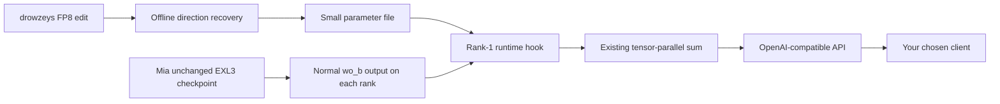

# DeepSeek V4.1 Flash Abliterated-Cyber on Two DGX Sparks (EXL3)

Run Mia AI Lab's compressed DeepSeek V4.1 Flash checkpoint across **two NVIDIA DGX Sparks**, with a small runtime hook that approximately reproduces the rank-1 edit recovered from drowzeys' Abliterated-Cybersecurity-Unleashed release. The EXL3 checkpoint stays unchanged. The result is served through an OpenAI-compatible API and can be used with a client of your choice.

**This project connects two upstream contributions:**

- **[drowzeys — DeepSeek-V4.1-Flash-Abliterated-Cybersecurity-Unleashed](https://huggingface.co/drowzeys/DeepSeek-V4.1-Flash-Abliterated-Cybersecurity-Unleashed):** the original edited FP8 attention sidecar used for our offline characterization.
- **[Mia AI Lab — DeepSeek-v4.1-Flash-EXL3-2x-DGX-Sparks](https://github.com/MiaAI-Lab/DeepSeek-v4.1-Flash-EXL3-2x-DGX-Sparks):** the EXL3 checkpoint, file-backed Engram integration, and two-Spark serving foundation.

Our contribution is recovering an approximate shared direction from the edit, applying it in Mia's runtime without re-quantizing the checkpoint, and documenting the configuration, validation, and recovery process. Credit for the original model belongs to [DeepSeek](https://huggingface.co/deepseek-ai/DeepSeek-V4.1-Flash).

**Evidence boundary:** the original two-Spark deployment generated coherent responses with the hook firing on all 26 target layers on both ranks at alpha 3.5. This publication's preparation helper reconstructed the deployed code byte for byte. A fresh full parameter derivation and a second hardware installation using this organized guide have not been completed. Regenerated parameters require their own evaluation; the title does not claim exact equivalence to the upstream edited checkpoint or guaranteed behavior on every prompt.

Jump to: [assistant handoff](#use-this-readme-as-a-replication-handoff) · [design](#why-a-runtime-hook-makes-this-work) · [requirements](#hardware-storage-and-software-requirements) · [setup](#1-check-both-nodes-and-the-dedicated-fabric) · [parameters](#4-obtain-the-original-fp8-sidecar-and-derive-parameters) · [stock baseline](#5-establish-a-stock-baseline-first) · [hook build](#6-prepare-and-build-the-hook-image) · [verification](#8-verify-the-actual-runtime-on-both-ranks) · [clients](#9-connect-an-openai-compatible-client) · [rollback](#10-roll-back-to-stock) · [privacy](#distribution-privacy-and-repository-contents).

## Use this README as a replication handoff

The complete sequence is below. Commands run in **Bash on the head Spark**, except steps explicitly labeled for both nodes or a client machine. They are not PowerShell commands. Work through the numbered sections in order and stop at a failed check instead of skipping ahead.

To get help from ChatGPT or another assistant, paste this README along with this instruction. An assistant without terminal access can walk you through the commands, but cannot execute them or validate your machines itself.

```text
Help me reproduce the two-Spark DeepSeek V4.1 Flash Abliterated-Cyber
EXL3 runtime-hook deployment described in this README.

Use this guide and its repository's tools as the implementation reference.
Preserve its pinned revisions, image digest, runtime insertion point,
alpha 3.5, and layers 10-35. Do not substitute a moving upstream main
branch, a different quantization, or the newer EXL3 weight sidecar.

First determine which machine is the head and which is the worker.
Inspect available memory, disk, Docker/GPU access, the dedicated CX7
interfaces, IPv4 RoCE v2 GIDs, and head-to-worker SSH. Ask me for missing
environment values; do not invent addresses, usernames, paths, or GIDs.
Keep credentials and private key contents out of the conversation.
Authentication should happen locally through the provider's login flow.

Follow the numbered steps, preserving unrelated services and files.
Confirm availability before stopping an existing model pair or changing
network settings. Record stock generation before enabling the hook.
Obtain the original gated FP8 sidecar through its authorized access flow,
derive parameters locally, and retain their manifest and hashes privately.
Install the hook on both ranks before graph capture. Use new cache
directories when switching configuration. Do not edit checkpoint weights.

Require actual generation, matching runtime artifacts, and 26 distinct
fired layers on each rank. A health response alone is insufficient.
Separate source checks, numerical checks, hardware inference, and
behavioral evaluation in the result. If something is untested or blocked,
say exactly what remains. Keep the stock rollback available.

Before sharing any output, remove personal names, credentials, private
addresses, hostnames, local account paths, raw logs, and conversations.
```

## Why a runtime hook makes this work

The original edit targets `attn.wo_b` on backbone layers 10 through 35. Its sidecar stores FP8 E4M3 weights and UE8M0 block scales. Mia's corresponding matrices use packed EXL3 trellis tensors. **The incompatibility is in the weight representation and loader, not in the underlying attention concept.** Copying FP8 tensors into an EXL3 checkpoint does not make them loadable.

The alternatives include re-encoding the affected matrices, re-quantizing a larger checkpoint, or adding a mixed-format loader. This deployment instead recovers an approximate output-space direction and moves the edit to the ordinary linear output:

```text
W_edited ≈ (I − α r rᵀ) W_native
y = W_EXL3 x
y_hook = y − α r (rᵀ y)

r: shared 5,120-dimensional unit vector
α: 3.5
targets: layers 10–35, attn.wo_b, on both ranks
```

The reduction and correction use FP32 before casting back to the output dtype. At alpha 3.5, the component along `r` gets a gain of **−2.5**: it is reversed and amplified. Only alpha 1 would remove that component by projection. The formula does not depend on how the weights were compressed, but the supplied integration is specific to this pinned EXL3/vLLM serving path.

The operation is linear, so applying the same transform to both tensor-parallel partial outputs before their existing sum gives `T(y0) + T(y1) = T(y0 + y1)`. It needs no additional collective. This assumes the output coordinates and bias-free layer behavior verified for this particular implementation.



Mia's compression and file-backed Engram make the model fit; the hook adds the recovered edit without creating another large checkpoint. The upstream edited-model repository also has a newer Mia-compatible EXL3 sidecar. That is a separate weight-graft route, was not deployed here, and must not be substituted into this guide's FP8 derivation command. See [the derivation details](docs/DESIGN.md).

## Hardware, storage, and software requirements

| Item | Reproduction target |
| --- | --- |
| Compute | Two NVIDIA DGX Sparks, GB10, approximately 121.7 GiB usable unified memory each |
| Host software | Working Spark Linux installation, compatible NVIDIA driver/container runtime, Docker access on both nodes |
| Interconnect | Dedicated ConnectX-7 link with active RDMA and IPv4 RoCE v2; check each node's GID independently |
| Utilities | Bash, Git, Python 3 with `venv`, rsync, SSH/SCP, curl; internet access for pinned downloads |
| EXL3 checkpoint | 39 shards, approximately 196.14 GiB, replicated on each node |
| Native Engram source | Shards 47 and 48 plus native config/index, approximately 189.13 GiB, replicated on each node |
| Disk planning | About **385.3 GiB of model data per node**, plus Docker images, download metadata, overlay, and scratch space |
| Resident model allocation | Approximately 99 GiB per rank in the original run; leave room for OS, graphs, workspaces, and caches |
| Serving | TP=2, native DSpark with three draft tokens, two sequences, 1 GiB configured KV pool per rank |
| Context setting | 131,072 tokens; a full-length prompt was not validated by this project |
| API model identifier | `DeepSeek-v4.1-Flash-EXL3` — capitalization matters |

Engram's file backing reduces resident memory; it does not eliminate disk usage. The head's native and slim Engram trees should share a filesystem so the kit can hard-link the shards. Otherwise allow space for an additional physical copy. This is a tightly budgeted deployment: disk size divided by two is not a complete RAM budget, and this guide does not establish that every alternative quantization requires four Sparks.

Use machines available for this deployment. The commands start and stop the named serving containers, perform substantial downloads, and replicate data to the worker. The guide assumes an already working GPU/container installation; it does not prescribe an unverified OS or driver upgrade.

## Pinned sources

| Component | Pinned revision |
| --- | --- |
| Mia serving kit | `85305680fb0f8ebc72b7b8ebf49ba54471019285` |
| `Mia-AiLab/DeepSeek-V4.1-Flash-EXL3-2.9bpw` | `64ba41b6c916a587db06eae2e19b7845f7be6e6b` |
| `deepseek-ai/DeepSeek-V4.1-Flash` | `dba1be0a40aa45a94ad051997016db3960a90277` |
| drowzeys' original FP8 sidecar repository | `87bb9850e6f49fd20ad9c8516b7817215cbbf5fc` |

The immutable base image is specified in step 5 and in `tools/prepare.py`. The kit uses vLLM `0.1.dev20904+g179dd0fa9`. The preparation helper rejects unexpected launcher or overlay hashes rather than silently patching a different version.

The native and sidecar revisions pin a new derivation. They do not retroactively prove the exact revisions of older downloads made from `main`. Keep your own source hashes and derivation report. See [the evidence record](evidence/RESULTS.md) for this distinction and the original tested artifact hashes.

## 1. Check both nodes and the dedicated fabric

On **each Spark**, inspect the machine before changing anything:

```bash
uname -m
nvidia-smi
docker info --format '{{.Architecture}}'
docker ps
free -h
df -h "$HOME"
ip -br -4 addr
rdma link show
```

Expect an ARM64/aarch64 Spark, a visible GPU, working Docker access, sufficient free storage, and an active dedicated fabric. Identify the Ethernet interface, its matching RDMA HCA, and the IPv4 address on each node. Do not copy interface names or GID indices from another machine.

On each node, inspect the selected HCA's GIDs:

```bash
read -r -p 'Dedicated fabric HCA from rdma link show: ' HCA
BASE="/sys/class/infiniband/$HCA/ports/1"
for f in "$BASE"/gids/*; do
  i=${f##*/}
  printf '%s  %s  %s\n' "$i" "$(cat "$f")" "$(cat "$BASE/gid_attrs/types/$i")"
done
```

Choose the entry for that node's fabric **IPv4-mapped address** with type **RoCE v2**. Save its numeric index for `HEAD_GID` or `WORKER_GID`. A nonempty IPv6 entry at the same index is not equivalent. Verify that fabric addressing persists across restart; see [dedicated-link configuration and recovery](docs/OPERATIONS.md#fabric-address-and-gid-after-a-reboot) if it does not.

Establish key-based SSH from head to worker using your own account and local SSH setup. Private key contents never belong in this repository or a chat. Keep management networking unchanged. The next section records your local values and checks peer reachability.

## 2. Clone, configure, and create the tools environment

On the **head**, use new directories. If these paths already contain work, inspect them and choose separate paths instead of overwriting them:

```bash
set -euo pipefail
export GUIDE="$HOME/deepseek-v41-exl3-two-sparks"
export KIT="$HOME/dsv41-kit"
export BUILD_DIR="$HOME/dsv41-hook-build"
git clone --config core.autocrlf=false \
  https://github.com/ultradaoto/deepseek-v41-exl3-two-sparks.git "$GUIDE"
git clone --config core.autocrlf=false \
  https://github.com/MiaAI-Lab/DeepSeek-v4.1-Flash-EXL3-2x-DGX-Sparks.git "$KIT"
git -C "$KIT" checkout 85305680fb0f8ebc72b7b8ebf49ba54471019285
python3 -m venv "$HOME/dsv41-tools"
source "$HOME/dsv41-tools/bin/activate"
python -m pip install -r "$GUIDE/requirements.txt" huggingface_hub
```

Create a **private local profile** and edit the placeholders. The template contains the conservative memory settings used by this project. All `REPLACE_...` values must be replaced with your own values, including the worker's actual absolute home directory. Use ordinary Linux paths without spaces or shell metacharacters; the upstream launcher embeds paths in remote shell commands.

```bash
cp -n "$GUIDE/examples/profile.env" "$GUIDE/profile.local.env"
chmod 600 "$GUIDE/profile.local.env"
${EDITOR:-nano} "$GUIDE/profile.local.env"
```

Keep these decisions explicit in the edited profile:

| Setting | Required meaning |
| --- | --- |
| `HEAD_IP`, `WORKER_IP` | Your two dedicated fabric IPv4 addresses |
| `WORKER_USER`, `WORKER_HOME`, `WORKER_SSH` | Your worker account, absolute home, and SSH destination |
| `HEAD_CX7_IF`, `WORKER_CX7_IF` | Each node's actual fabric Ethernet interface |
| `HEAD_CX7_IB`, `WORKER_CX7_IB` | Each node's matching RDMA HCA |
| `HEAD_GID`, `WORKER_GID` | Each node's verified IPv4 RoCE v2 GID index |
| `MODEL_HOST`, `ENGRAM_DIR`, `ENGRAM_SRC` | Separate checkpoint, native source, and generated slim Engram paths |
| `WEIGHT_SYNC=rsync`, `NFS_SHARE=0` | Local worker replicas, matching this deployment |
| `AUTO_DOWNLOAD=0` | Use the explicitly downloaded revisions |
| `CACHE_ROOT`, `WORKER_VLLM_CACHE` | New stock-specific cache directories, separate from model data |

Merge your profile into a fresh copy of the pinned kit's defaults. This preserves the kit's other kernel/runtime settings while replacing its larger context and KV defaults. The following command refuses an existing `.env` and unresolved placeholders:

```bash
python - <<'PY'
import os, re
from pathlib import Path
guide, kit = Path(os.environ['GUIDE']), Path(os.environ['KIT'])
updates = {}
for line in (guide / 'profile.local.env').read_text().splitlines():
    if re.match(r'^[A-Z][A-Z0-9_]*=', line):
        key, value = line.split('=', 1)
        if not value or 'REPLACE_' in value:
            raise SystemExit(f'Complete your local profile: {key}')
        updates[key] = value
result = []
for line in (kit / '.env.example').read_text().splitlines():
    key = line.split('=', 1)[0]
    if key in updates:
        line = key + '=' + updates.pop(key)
    result.append(line)
result.extend(key + '=' + value for key, value in updates.items())
with (kit / '.env').open('x') as output:
    output.write('\n'.join(result) + '\n')
(kit / '.env').chmod(0o600)
PY
bash -n "$KIT/.env"
set -a
source "$KIT/.env"
set +a
ping -c 3 "$WORKER_IP"
ssh -o BatchMode=yes "$WORKER_SSH" 'docker info --format "{{.Architecture}}"; command -v rsync; df -h "$HOME"'
```

Keep `ABLIT`, `ABLIT_ALPHA`, `ABLIT_PARAMS`, and `EXL3_OVERLAY_HOST` **out of `.env`**. They are explicit launch-time switches below. The launcher sources `.env` after the caller's environment and preserves only selected overrides; change cache paths in the file itself.

If you return in a new shell, enable `set -euo pipefail`, restore `GUIDE`, `KIT`, and `BUILD_DIR` to your chosen paths, activate the tools environment, and source your private `.env` as above. Restore `PARAMS` after deriving it in step 4. Do not paste your profile into a public issue.

## 3. Download the checkpoint and native Engram

Before launching the model, download the pinned files on the head:

```bash
mkdir -p "$MODEL_HOST" "$ENGRAM_DIR"
hf download Mia-AiLab/DeepSeek-V4.1-Flash-EXL3-2.9bpw \
  --revision 64ba41b6c916a587db06eae2e19b7845f7be6e6b \
  --local-dir "$MODEL_HOST"
hf download deepseek-ai/DeepSeek-V4.1-Flash \
  model-00047-of-00048.safetensors model-00048-of-00048.safetensors \
  model.safetensors.index.json config.json LICENSE \
  --revision dba1be0a40aa45a94ad051997016db3960a90277 \
  --local-dir "$ENGRAM_DIR"
find "$MODEL_HOST" -maxdepth 1 -name 'model-*.safetensors' | wc -l
test -s "$ENGRAM_DIR/model-00047-of-00048.safetensors"
test -s "$ENGRAM_DIR/model-00048-of-00048.safetensors"
test -s "$ENGRAM_DIR/model.safetensors.index.json"
test -s "$ENGRAM_DIR/config.json"
```

Require successful download completion, **39 EXL3 shards**, and both native Engram shards plus their native config and index. The shell checks detect missing files; they are not a substitute for the download client's integrity checks. Keep the native tree separate from the EXL3 checkpoint. Omitting the native `config.json` causes a later `/engram-src/config.json` failure.

On the first start, the kit builds a slim Engram source and rsyncs it and the EXL3 tree to the worker. Allow time for about 385 GiB of replication. Do not skip the first sync. [Hugging Face download reference](https://huggingface.co/docs/huggingface_hub/guides/download)

## 4. Obtain the original FP8 sidecar and derive parameters

Open [drowzeys' repository](https://huggingface.co/drowzeys/DeepSeek-V4.1-Flash-Abliterated-Cybersecurity-Unleashed) with your own Hugging Face account and complete its access agreement. Authenticate **locally** using `hf auth login`; never put a token into this README, a shell command committed to Git, or a chat transcript.

Run this CPU work before loading the model, or on a separate CPU machine with this repository and its NumPy dependency:

```bash
cd "$GUIDE"
hf auth login
hf download drowzeys/DeepSeek-V4.1-Flash-Abliterated-Cybersecurity-Unleashed \
  wo_b_l10_35.safetensors \
  --revision 87bb9850e6f49fd20ad9c8516b7817215cbbf5fc \
  --local-dir "$GUIDE/downloads"
python "$GUIDE/tools/derive_params.py" \
  --overlay "$GUIDE/downloads/wo_b_l10_35.safetensors" \
  --out "$GUIDE/build/params/wob_hook_params.npz"
export PARAMS="$GUIDE/build/params/wob_hook_params.npz"
sha256sum "$PARAMS"
```

The helper fetches approximately another gigabyte of selected native FP8 tensor byte ranges, decodes 32×32 scales, estimates a dominant direction for each of 26 matrices, sign-aligns and averages those directions, then writes a unit vector and 26 alpha values of 3.5. It also writes `wob_hook_params.derivation.json`. Each matrix contains over 41 million elements; allow substantial CPU time and memory.

It rejects whole-shard responses if a server does not honor the requested byte ranges. It does not bypass gated access. Use **`wo_b_l10_35.safetensors`**, not the newer `mia_exl3_wo_b_l10_35.safetensors`. If you derived parameters elsewhere, copy the resulting NPZ to the head and set `PARAMS` to that local absolute path.

The original tested parameter file was 21,534 bytes. Numerical libraries and quantization bias can make regeneration differ; matching dimensions alone does not prove matching behavior. Keep the derivation report and evaluate your artifact. The guide ships the recovery procedure, not the gated source data or a guaranteed byte-identical recovered vector.

## 5. Establish a stock baseline first

Pull the immutable base image, tag it locally, and transfer that same image to the worker. Keep `pipefail` enabled so a failed stream is visible:

```bash
BASE_IMAGE=ghcr.io/miaai-lab/deepseek-v4.1-flash-exl3-2x-dgx-sparks@sha256:2f0cf3adc0f989c1d446be274df864eb799630175f604c3b22b71b7205971dce
docker pull "$BASE_IMAGE"
docker tag "$BASE_IMAGE" dsv41-flash-exl3:stock-pinned
set -o pipefail
docker save dsv41-flash-exl3:stock-pinned | ssh "$WORKER_SSH" docker load
docker image inspect -f '{{.Id}}' dsv41-flash-exl3:stock-pinned
ssh "$WORKER_SSH" "docker image inspect -f '{{.Id}}' dsv41-flash-exl3:stock-pinned"
cd "$KIT"
env -u ABLIT -u ABLIT_ALPHA -u ABLIT_PARAMS -u EXL3_OVERLAY_HOST \
  IMAGE=dsv41-flash-exl3:stock-pinned \
  SKIP_SYNC=0 SKIP_PULL=1 SKIP_BUILD=1 SKIP_SHIP=1 TAIL=0 ./start.sh
```

Both image IDs must match. The launcher performs GPU self-checks, stages runtime files, syncs weights, starts both ranks, and waits for readiness. Startup and warmup take time. Diagnose errors before proceeding; do not disable its checks simply to obtain a listening port.

After startup, require a completed inference response:

```bash
mkdir -p "$GUIDE/build/evidence"
python "$GUIDE/tools/check_api.py" \
  --base-url http://127.0.0.1:8888/v1 \
  | tee "$GUIDE/build/evidence/stock-api.json"
```

Expected: model `DeepSeek-v4.1-Flash-EXL3`, reply `323`, and `passed: true`. The helper also requires `finish_reason=stop`. A health endpoint or HTTP 200 streaming header is insufficient if the worker cannot generate.

Save a stock baseline for your own fixed evaluation set before changing the runtime. Then finish outstanding requests and stop this pair before building or switching configuration:

```bash
cd "$KIT"
./start.sh stop
```

## 6. Prepare and build the hook image

With both model ranks stopped and `PARAMS` pointing to your derived file:

```bash
python "$GUIDE/tools/prepare.py" \
  --kit "$KIT" --params "$PARAMS" --out "$BUILD_DIR"
bash -n "$KIT/start.sh"
cat "$BUILD_DIR/manifest.json"
docker build -t dsv41-flash-exl3:rank1-hook "$BUILD_DIR"
docker save dsv41-flash-exl3:rank1-hook | ssh "$WORKER_SSH" docker load
docker image inspect -f '{{.Id}}' dsv41-flash-exl3:rank1-hook
ssh "$WORKER_SSH" "docker image inspect -f '{{.Id}}' dsv41-flash-exl3:rank1-hook"
```

The helper requires a new build directory and the pinned stock source. It validates the direction, layer set, and alpha values; backs up `start.sh` to `start.sh.before-runtime-hook`; adds hook environment variables to both ranks' launcher paths; and writes a Dockerfile, patched overlay, parameter file, and manifest. It does not launch a model or edit checkpoint weights.

The generated code must match these deployed hashes:

| Artifact | SHA-256 |
| --- | --- |
| Hook overlay | `7f109bec461eb67a0122e8dffcf14bb94cadeed29d1a4e4681d0eee8a78e5cd0` |
| Patched launcher | `a6d942561d28b823834e0c21e337da62298ecf8d5461a9617acd3e235e6d34d4` |

The NPZ hash may differ from the original tested artifact; `matches_tested_params: false` records that distinction. Do not change expected hashes to bypass a source mismatch. Use LF checkouts: CRLF conversion changes the source bytes and is rejected.

The new image inherits the pinned compiled runtime and adds `/opt/dsv41/exl3.py` and `/opt/dsv41/wob_hook_params.npz`. **The launcher bind-mounts a host overlay over the baked file.** The explicit `EXL3_OVERLAY_HOST` setting in the next step is essential.

## 7. Choose fresh caches and start the hook

The following local-only edit gives the hook new cache directories based on its configuration ID and a run timestamp. It preserves Engram and checkpoint locations:

```bash
python - <<'PY'
import json, os, re
from datetime import datetime, timezone
from pathlib import Path
build, kit = Path(os.environ['BUILD_DIR']), Path(os.environ['KIT'])
identity = json.loads((build / 'manifest.json').read_text())['config_id']
run = datetime.now(timezone.utc).strftime('%Y%m%dT%H%M%S%fZ')
suffix = f'dsv41-hook-{identity}-{run}'
updates = {
    'CACHE_ROOT': str(Path.home() / '.cache' / suffix),
    'WORKER_VLLM_CACHE': os.environ['WORKER_HOME'] + '/.cache/' + suffix,
}
path = kit / '.env'
text = path.read_text()
for key, value in updates.items():
    pattern = re.compile(r'^' + key + r'=.*$', re.MULTILINE)
    if len(pattern.findall(text)) != 1:
        raise SystemExit(f'Expected exactly one {key} assignment')
    text = pattern.sub(lambda _: key + '=' + value, text)
path.write_text(text)
PY
cd "$KIT"
EXL3_OVERLAY_HOST="$BUILD_DIR/exl3.py" \
ABLIT=1 ABLIT_ALPHA=3.5 ABLIT_PARAMS=/opt/dsv41/wob_hook_params.npz \
IMAGE=dsv41-flash-exl3:rank1-hook \
SKIP_PULL=1 SKIP_BUILD=1 SKIP_SHIP=1 SKIP_SYNC=1 TAIL=0 ./start.sh
```

`SKIP_SYNC=1` is valid here because step 5 established both replicas. Both ranks need the same image, direction, layers, and strength. The hook must be installed before warmup and CUDA graph capture. Never change alpha, the direction, or `ABLIT` inside an already serving process; use a stop/start boundary and new configuration-specific caches.

## 8. Verify the actual runtime on both ranks

First compare the mounted overlay and NPZ hashes against your local build:

```bash
sha256sum "$BUILD_DIR/exl3.py" "$BUILD_DIR/wob_hook_params.npz"
docker exec dsv41-exl3-head \
  sha256sum /opt/dsv41/exl3.py /opt/dsv41/wob_hook_params.npz
ssh "$WORKER_SSH" \
  'docker exec dsv41-exl3-worker sha256sum /opt/dsv41/exl3.py /opt/dsv41/wob_hook_params.npz'
python "$GUIDE/tools/check_api.py" \
  | tee "$GUIDE/build/evidence/hook-api.json"
```

Then inspect only the current starts' logs:

```bash
HEAD_STARTED=$(docker inspect -f '{{.State.StartedAt}}' dsv41-exl3-head)
WORKER_STARTED=$(ssh "$WORKER_SSH" "docker inspect -f '{{.State.StartedAt}}' dsv41-exl3-worker")
docker logs --since "$HEAD_STARTED" dsv41-exl3-head 2>&1 \
  | grep '\[ablit\]' > "$GUIDE/build/evidence/head-hook.log"
ssh "$WORKER_SSH" "docker logs --since '$WORKER_STARTED' dsv41-exl3-worker 2>&1" \
  | grep '\[ablit\]' > "$GUIDE/build/evidence/worker-hook.log"
python - <<'PY'
import os, re
from pathlib import Path
root = Path(os.environ['GUIDE']) / 'build/evidence'
for rank in ('head', 'worker'):
    text = (root / f'{rank}-hook.log').read_text()
    fired = re.findall(r'\[ablit\] fired L(\d+).*?alpha=([0-9.]+)', text)
    layers = {int(layer) for layer, alpha in fired if float(alpha) == 3.5}
    if layers != set(range(10, 36)) or any(float(a) != 3.5 for _, a in fired):
        raise SystemExit(f'{rank}: missing layers or unexpected alpha; inspect local logs')
    print(f'{rank}: all 26 layers fired at alpha 3.5')
PY
```

An `INSTALLED` message alone is insufficient. Require layers 10–35 on **each** rank and completed generation. Keep logs local: even short diagnostic excerpts can contain machine-specific details.

For behavioral checks, use the same prompts, seed, temperature, thinking setting, and token budget as your stock baseline. Start with arithmetic, simple definitions, and ordinary technical tasks, then use an authorized security evaluation relevant to your use case. Score complete responses; token-limit truncations are inconclusive. Engagement is not proof that generated code is correct or effective. The [historical evaluation](evidence/RESULTS.md) applies to the original artifact and is not automatically inherited by a regenerated vector.

## 9. Connect an OpenAI-compatible client

The server advertises **`DeepSeek-v4.1-Flash-EXL3`**. A display label or an obsolete alias in a client does not create a model on the server.

| Client setting | Value |
| --- | --- |
| API type | OpenAI-compatible chat completions |
| API root | `http://<your-reachable-head>:8888/v1` |
| Model ID | `DeepSeek-v4.1-Flash-EXL3` |
| Context limit | At most 131072 for this profile |
| Initial smoke | Non-streaming, short output, thinking disabled |

Some clients expect a host URL and append `/v1`; others expect the complete API root. Check the client's convention to avoid `/v1/v1/chat/completions`. If an existing session keeps sending an old model ID, select the current model in that session or start a new one.

On the head, a direct request needs no client-specific configuration:

```bash
curl --fail-with-body --max-time 10 http://127.0.0.1:8888/v1/models
curl --fail-with-body --max-time 90 http://127.0.0.1:8888/v1/chat/completions \
  -H 'Content-Type: application/json' \
  -d '{"model":"DeepSeek-v4.1-Flash-EXL3","messages":[{"role":"user","content":"What is 17 times 19? Reply with only the integer."}],"temperature":0,"max_tokens":32,"stream":false,"chat_template_kwargs":{"enable_thinking":false}}'
```

The provided API smoke helper assumes an unauthenticated private endpoint. This guide does not configure an internet-facing gateway. For remote access, use your own trusted network or a local SSH tunnel; the fabric address is not necessarily reachable from a client. See [generic client access](docs/CLIENTS.md).

## 10. Roll back to stock

Rollback changes the serving configuration because the weights were never edited. Finish requests, stop the pair, and change the two cache paths to fresh stock-specific directories:

```bash
cd "$KIT"
./start.sh stop
${EDITOR:-nano} "$KIT/.env"
```

In that file, set new `CACHE_ROOT` and `WORKER_VLLM_CACHE` paths and keep checkpoint/Engram paths fixed. Remove any hook-only settings if you added them despite the earlier instructions. Then:

```bash
env -u EXL3_OVERLAY_HOST -u ABLIT -u ABLIT_ALPHA -u ABLIT_PARAMS \
  IMAGE=dsv41-flash-exl3:stock-pinned \
  SKIP_PULL=1 SKIP_BUILD=1 SKIP_SHIP=1 SKIP_SYNC=1 TAIL=0 ./start.sh
python "$GUIDE/tools/check_api.py"
```

Require successful generation and no hook installation/firing in the new process's logs. The launcher defaults to its unchanged stock overlay. Its environment-passthrough patch can remain inert; `start.sh.before-runtime-hook` is available for a full source rollback after checking for later edits.

## Troubleshooting

| Symptom | Check and resolution |
| --- | --- |
| `404` / model does not exist | Read `/v1/models`; use the exact advertised identifier, including in existing sessions |
| Health is OK but requests never produce tokens | Inspect both ranks; the head can remain alive while its worker is missing |
| NCCL initialization hangs or fails | Verify peer reachability, Ethernet/HCA pairing, and each node's IPv4 RoCE v2 GID |
| Fabric address vanishes | Correct the dedicated interface's persistent network profile; a temporary `ip addr add` is insufficient |
| Restart fails after reboot | The pinned launcher stages worker bind sources under `/tmp`; rerun the configured launcher to restore all sources |
| Missing `/engram-src/config.json` | Include native config and index alongside shards 47/48, then rebuild/sync the slim source |
| Hook image is present but hook is absent | The host bind mount may shadow it; verify `EXL3_OVERLAY_HOST` and mounted hashes |
| Empty parameter filename | Supply `ABLIT_PARAMS=/opt/dsv41/wob_hook_params.npz`; do not pass an empty value |
| Preparation rejects source hashes | Use the pinned LF checkout and unchanged runtime suffix; do not bypass the hash guard |
| Build directory already exists | Preserve it and choose a new `BUILD_DIR` |
| Memory pressure or OOM | Restore the documented conservative profile; inspect both nodes and isolate other memory consumers |
| Short response or lengthy hidden reasoning | Disable thinking for smoke tests and inspect `finish_reason`; do not score truncation as success |

This guide does not install reboot automation. Persistent network/storage setup and a separately tested service startup order are needed for unattended recovery; a Docker restart policy alone does not restore missing bind sources. See [operations and recovery](docs/OPERATIONS.md).

## What has been measured

The original run verified coherent generation and 26 fired layers per rank at alpha 3.5. A local stock/hook experiment recorded nine valid paired changes from stock refusal to hook engagement. Three hook responses were token-limited and excluded from valid pairs. Human-style scoring was performed by an unblinded assistant with some benign labels automated; generated code was not executed.

A small sequential sample measured median endpoint throughput of 26.14 tokens/s with the hook versus 27.63 stock, about 5.4% lower. That includes prefill and HTTP handling, uses different generated text, and is not isolated hook overhead. It is not a general benchmark guarantee. The [full evidence record](evidence/RESULTS.md) states the sample counts, controls, limitations, and artifact identities.

## Distribution, privacy, and repository contents

There are no model weights, gated sidecar bytes, recovered parameter vectors, deployment credentials, personal workstation paths, private host inventories, or conversation databases in this release. Network/account fields in the template are placeholders; `127.0.0.1` in examples is the reader's own loopback address. Keep your filled profile, `.env`, build outputs, logs, downloads, and authentication state private.

This repository is public under its GitHub owner account, and GitHub exposes repository ownership and commit attribution. Sanitizing the files does not anonymize that account or erase previous public copies. The [privacy review](docs/PRIVACY_REVIEW.md) records the inspected scope and limits.

| Path | Purpose |
| --- | --- |
| `runtime/wo_b_hook_append.py` | Exact deployed runtime suffix; do not reformat when reproducing hashes |
| `tools/derive_params.py` | CPU recovery from an authorized local FP8 sidecar |
| `tools/prepare.py` | Guarded launcher patch and hook build directory |
| `tools/check_api.py` | Model-discovery and completed arithmetic smoke check |
| `examples/profile.env` | Placeholder-only local configuration template |
| `tests/test_helpers.py` | Focused numerical and failure-path checks |
| `evidence/` | Sanitized historical measurements and packaging checks |
| `docs/` | Additional design, operation, access, and distribution notes |

Copying the unchanged EXL3 weights to Hugging Face would not bake in the hook. A compact recipe plus separately authorized parameters and pinned upstream references is more efficient than another roughly 385 GiB data bundle. This release leaves parameter derivation local; see [Hugging Face distribution options](docs/HUGGING_FACE.md).

## Credits and licenses

- **[drowzeys](https://huggingface.co/drowzeys/DeepSeek-V4.1-Flash-Abliterated-Cybersecurity-Unleashed):** original abliteration sidecar and edited-model release.
- **[Mia AI Lab](https://github.com/MiaAI-Lab/DeepSeek-v4.1-Flash-EXL3-2x-DGX-Sparks):** EXL3 2.9bpw checkpoint and two-Spark serving foundation.
- **[DeepSeek](https://huggingface.co/deepseek-ai/DeepSeek-V4.1-Flash):** base model.
- **[Arditi et al.](https://arxiv.org/abs/2406.11717):** refusal-direction research context; recovering one direction does not establish universal control over a model's behavior.

The guide and its code are [AGPL-3.0](LICENSE), consistent with the pinned serving kit. Model data has separate notices and access terms. The sidecar's license metadata does not replace its additional access agreement. See [NOTICE](NOTICE.md). This is an independent community integration; no upstream endorsement is claimed.
